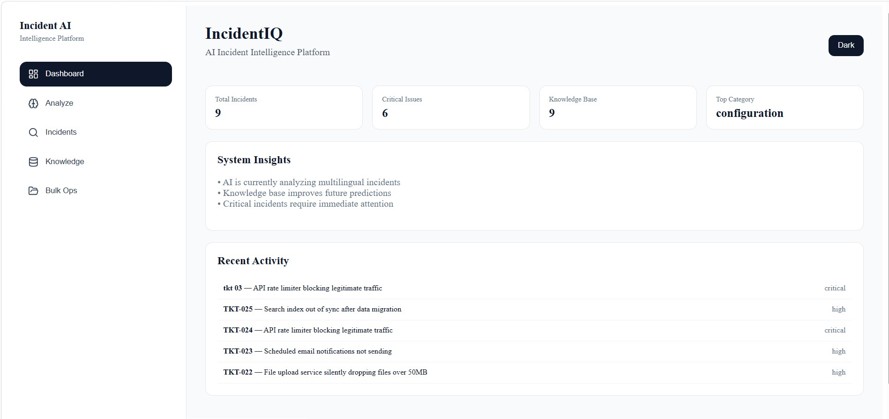
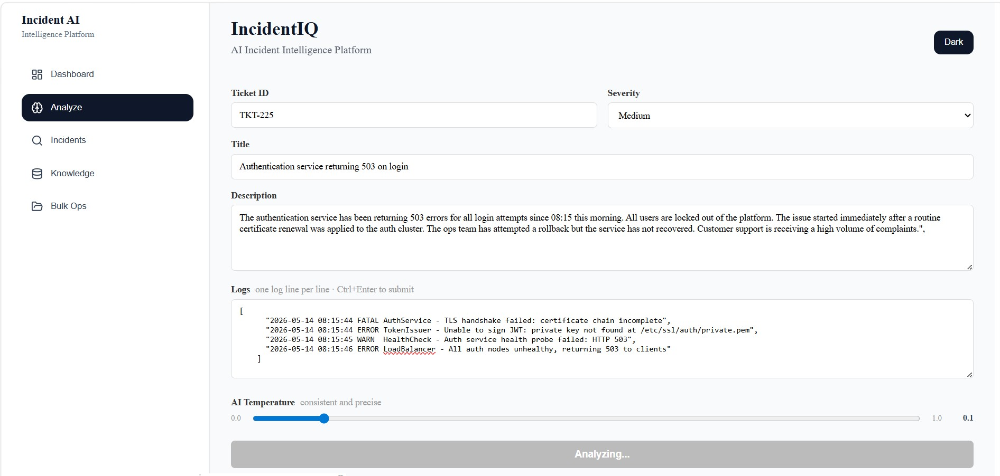
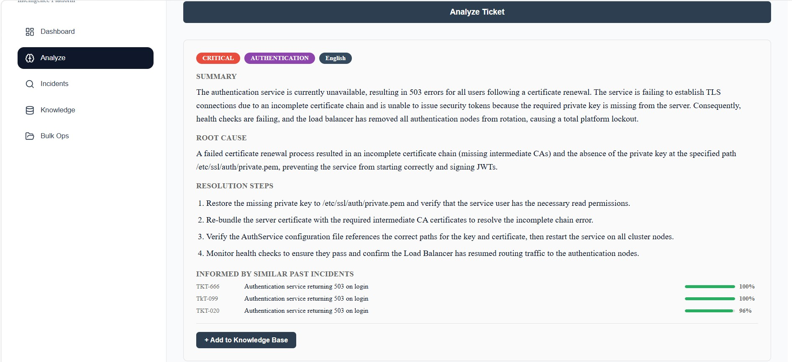
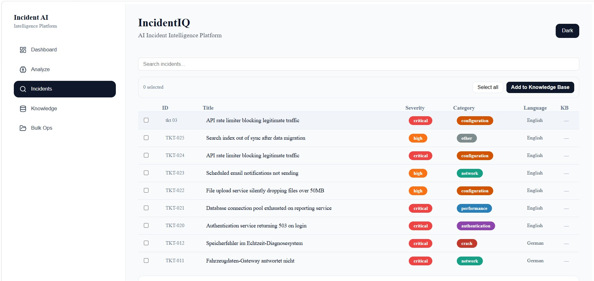
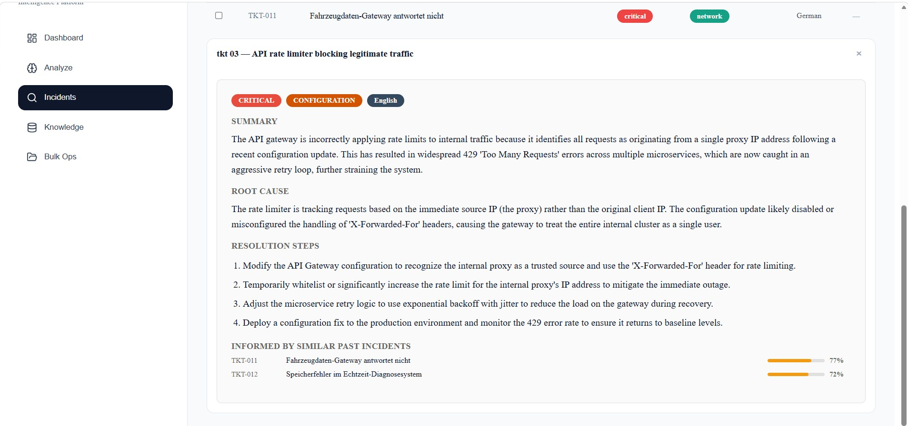
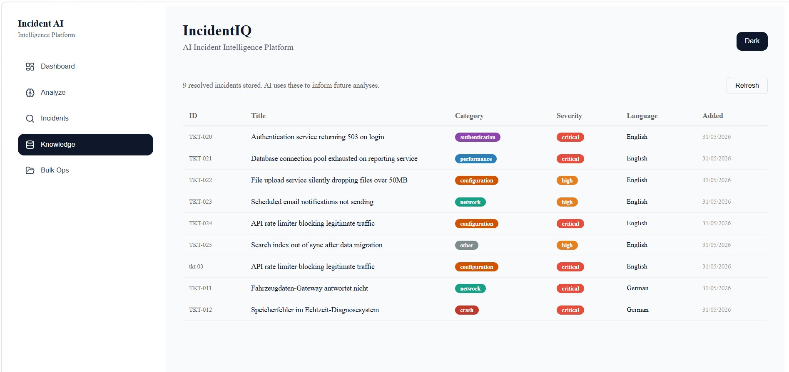
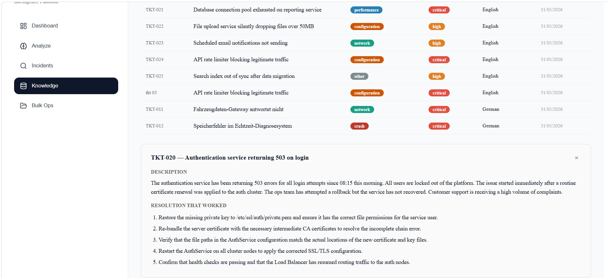
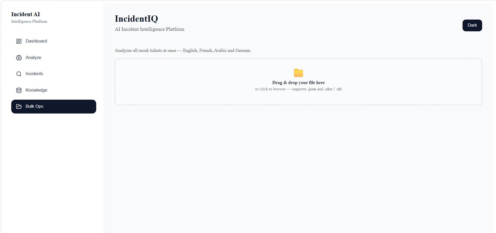
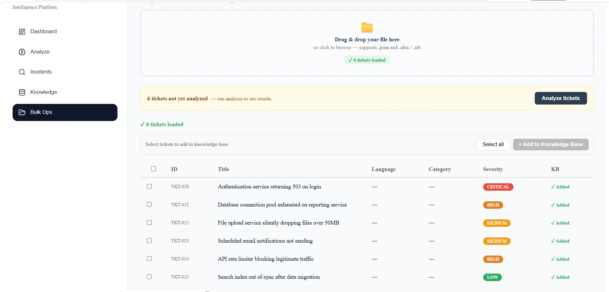

# IncidentIQ — AI Incident Intelligence Platform

IncidentIQ is a multilingual incident analysis platform built with NestJS,
React, and Google Gemini. It combines a RAG pipeline, vector embeddings, and
cosine similarity search to analyze support tickets, surface relevant historical
context, and generate structured resolutions — across any language.

Built for real operational complexity. Not a tutorial project.

[](https://nestjs.com)
[](https://reactjs.org)
[](https://ai.google.dev)

## Live Demo

🔗[](https://youtu.be/UN4Iyu9GDAs)


## Screenshots

### Dashboard



### Analyze Ticket




### Incidents




### Knowledge Base




### Bulk Operations




---

## What it does

- **Multilingual analysis** — reading incident reports across multiple languages

- **RAG pipeline** — uses vector embeddings and cosine similarity search to
  surface semantically similar past incidents and improve analysis accuracy
- **Knowledge base** — learns from resolved incidents over time, informing
  future analyses with real historical context
- **Bulk analysis** — upload JSON or Excel files and analyze multiple tickets
  at once with a real-time progress bar
- **Temperature control** — adjustable AI creativity from fully deterministic
  to highly creative, showing understanding of LLM behavior
- **Dashboard** — live stats showing total incidents, critical issues, top
  category, and knowledge base size
- **Dark mode** — full theme support across all screens

---

## Architecture

Frontend (React + React Query)
↓ HTTP
Backend (NestJS REST API)
↓ ↓
PostgreSQL DB Google Gemini AI
↓
Embedding API (RAG)
Generation API (Analysis)

**Key engineering decisions:**

- RAG over simple keyword search — finds semantically similar incidents
  across languages using cosine similarity on Gemini embeddings
- React Query for server state — automatic caching, background refetch,
  and cache invalidation instead of manual useState/useEffect patterns
- Modular NestJS architecture — separate modules for tickets, analysis,
  and knowledge base with explicit dependency injection
- DTOs with class-validator — all incoming data validated at the API
  boundary before reaching business logic

---

## Tech stack

| Layer              | Technology           |
| ------------------ | -------------------- |
| Backend framework  | NestJS + TypeScript  |
| Database           | PostgreSQL + TypeORM |
| AI / Embeddings    | Google Gemini API    |
| Frontend framework | React + TypeScript   |
| Server state       | TanStack React Query |
| HTTP client        | Axios                |
| File parsing       | SheetJS (xlsx)       |
| Validation         | class-validator      |

---

## Getting started

### Prerequisites

- Node.js 18+
- PostgreSQL 14+
- Google Gemini API key (free at aistudio.google.com)

### Backend

```bash
cd backend
npm install
cp .env.example .env
# fill in your values:
# GEMINI_API_KEY=your_key
# DATABASE_HOST=localhost
# DATABASE_PORT=5432
# DATABASE_USER=postgres
# DATABASE_PASSWORD=your_password
# DATABASE_NAME=ticket_analyzer
npm run start:dev
```

### Frontend

```bash
cd frontend
npm install
cp .env.example .env
# REACT_APP_API_URL=http://localhost:3000
npm start
```

---

## API Endpoints

### Tickets

| Method | Endpoint                | Description                       |
| ------ | ----------------------- | --------------------------------- |
| `GET`  | `/tickets`              | Get all analyzed tickets          |
| `GET`  | `/tickets/:id`          | Get ticket by ID                  |
| `POST` | `/tickets`              | Analyze and store a single ticket |
| `POST` | `/tickets/bulk-analyze` | Bulk analyze multiple tickets     |

### Analysis

| Method | Endpoint            | Description                      |
| ------ | ------------------- | -------------------------------- |
| `POST` | `/analysis/analyze` | Analyze a ticket without storing |

### Knowledge Base

| Method | Endpoint                | Description                                 |
| ------ | ----------------------- | ------------------------------------------- |
| `GET`  | `/knowledge-base`       | Get all knowledge base entries              |
| `GET`  | `/knowledge-base/count` | Get total entry count                       |
| `POST` | `/knowledge-base`       | Add a resolved ticket to the knowledge base |

---

## How the RAG pipeline works

1. When a ticket is resolved and added to the knowledge base its text
   is converted to a 768-dimensional vector using Gemini's embedding API
2. When a new ticket arrives its text is also embedded
3. Cosine similarity is calculated against every stored embedding
4. The top 3 most similar past incidents are retrieved
5. Those incidents are injected into the Gemini prompt as context
6. The model returns analysis informed by both its training and your
   specific historical data

This means the system gets smarter the more incidents you resolve.

---

## Why I built this

I spent months working second-level technical support for enterprise
automotive clients reading incident reports in multiple languages
and manually identifying root causes and writing resolutions every single day.

I built IncidentIQ because I was tired of doing that work manually every day
and wanted to see if I could automate it. Turns out, doing it properly meant
learning about embeddings, RAG pipelines, and how to make AI actually useful
in a real workflow, not just prompt it and hope for the best.
